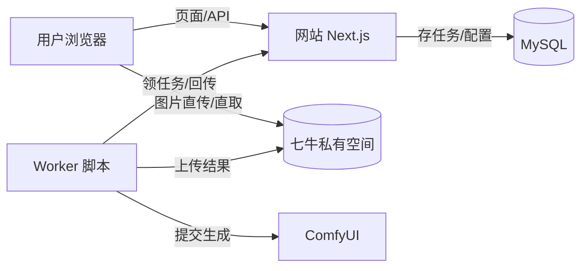
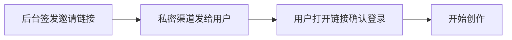
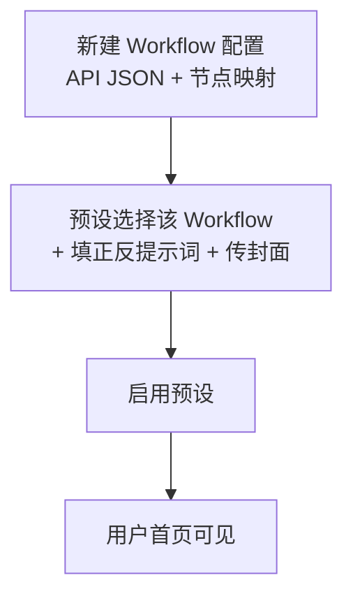
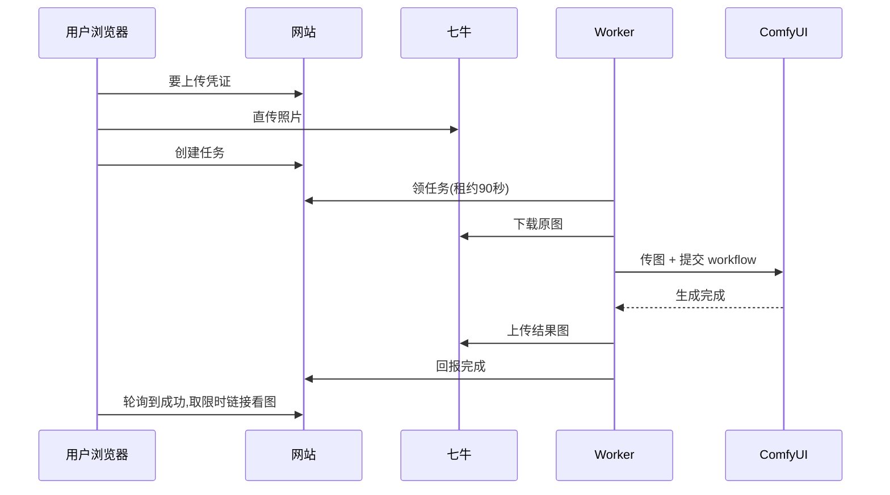

# QUICKSTART：15 分钟跑通本地全流程

> 面向第一次接触这个项目的人。跟着走一遍，你会得到：能登录的网站、一个真实 AI 生成的“世界名画”风格图片。
> 更深的原理和运维细节在 [`docs/runbooks/`](docs/runbooks/README.md)，这里只讲“怎么做”。

## 先看懂三句话

1. **网站**（Next.js）负责页面、登录、存数据，但**不直接生成图片**。
2. **图片存在七牛私有空间**，浏览器直传直取，网站只发“限时通行证”（签名链接）。
3. **Worker** 是一个独立小脚本，它从网站领任务、调用本机（或 Tailscale 远端）ComfyUI 生成、再把结果传回七牛。



## 0. 准备工作（约 2 分钟）

- 安装 Node.js 20+、`npm`，能联网。
- 准备一个 MySQL（本机或阿里云 RDS），记下连接串。
- 准备一个七牛 Kodo **私有空间** + HTTPS 下载域名（见 [七牛 runbook](docs/runbooks/qiniu-storage-and-jobs.md) 第 1–2 节）。
- 本机能访问 ComfyUI（本机 `http://127.0.0.1:8188`，或 Tailscale 地址如 `http://100.78.52.73:8188`）。

```bash
npm install
cp .env.example .env.local
```

打开 `.env.local`，把下面几项填上（生成随机串的命令见 [本地配置 runbook](docs/runbooks/local-mysql-and-auth.md)）：

| 变量 | 填什么 |
| --- | --- |
| `DATABASE_URL` | MySQL 连接串 |
| `ADMIN_API_TOKEN` | 后台登录密码（长随机串） |
| `WORKER_TOKEN` | Worker 密钥（长随机串，和网站填同一个值） |
| `APP_BASE_URL` | `http://localhost:3000` |
| `QINIU_*` | 七牛的 5 个值（AK/SK 只放服务端） |

<sub>`INVITATION_ENCRYPTION_KEY` 也要填（`openssl rand -base64 32`），否则邀请码签发不可用。生产环境另需 TLS 与独立账号，细节见 runbook。</sub>

## 1. 建表并启动（约 3 分钟）

```bash
npm run db:migrate
npm run dev
```

另开一个终端确认健康：

```bash
curl --fail --silent --show-error http://localhost:3000/api/health
# 期望：{"status":"ok","database":"ok"}
```

<sub>`database: unavailable` 表示连不上库，按 [本地配置 runbook](docs/runbooks/local-mysql-and-auth.md) 第 4 节逐项排查；不要把 `.env.local` 贴到聊天里。</sub>

## 2. 进后台，发一张“门票”（约 3 分钟）

1. 打开 `http://localhost:3000/admin`，用 `ADMIN_API_TOKEN` 登录。
2. 「邀请码」页随便填个订单引用（如 `test-001`），签发一条登录链接。
3. 用**无痕窗口**打开那条链接，确认能登录并看到用户标识。



<sub>链接可重复登录直到过期/撤销；淘宝自动发货走 API 幂等签发，见 [签发 runbook](docs/runbooks/issue-invitation-links.md)。</sub>

## 3. 配一个能出图的风格（约 4 分钟）

开箱即用的演示风格没有 workflow，**不能真出图**。最快的方式：

1. 「Workflow 配置」→ 新建：粘贴一份 ComfyUI **API 格式** JSON（不是界面导出），配好节点映射。
   - 必填：`inputImage`（输入图节点）、`outputNodeIds`（最终保存节点）。
   - 可选：`prompt` / `negativePrompt` / `additional` 的目标节点。
   - <sub>节点 ID 必须真实存在于这份 JSON 里；`PreviewImage` 不是最终结果，不要选它。</sub>
2. 「预设目录」→ 新建或编辑：选分类、上传主展示图、**下拉选择刚建的 Workflow**、填写正向/负向提示词，启用。
   - <sub>保存时会锁定 Workflow 当前版本；以后改 Workflow 不影响已排队的任务。</sub>



## 4. 启动 Worker，看它出图（约 3 分钟）

```bash
WEB_API_BASE_URL=http://127.0.0.1:3000 \
COMFY_BASE_URL=http://127.0.0.1:8188 \
WORKER_TOKEN="<和 .env.local 里相同的值>" \
npm run start:worker
```

<sub>ComfyUI 在别的机器？把 `COMFY_BASE_URL` 换成它的内网/Tailscale 地址（例如 `http://100.78.52.73:8188`），**不要用公网地址**。Worker 只依赖 Node 内置模块，不用额外安装。</sub>

然后用登录用户上传一张照片、选刚配好的风格、点“上传并创建任务”：



成功的标志：任务状态 `queued → running → succeeded`，“我的作品”里出现结果图。
Worker 日志只会看到 `job_id` 和阶段，看不到图片和密钥，这是故意设计的。

## 出问题先看这里

| 现象 | 先查什么 |
| --- | --- |
| 任务一直 `queued` | Worker 没在跑 / `WORKER_TOKEN` 两边不一致 / 预设没配 Workflow |
| 任务变 `failed` | 点开任务看错误码，对照 [Worker runbook 故障表](docs/runbooks/comfyui-worker.md) |
| 结果图打不开 | 签名链接约 5 分钟过期，刷新页面重取；检查七牛下载域名 |
| `execution_uncertain` | 可能已提交但 ID 没记下来：**不要点重试**，先去 ComfyUI 队列/history 核实，再决定是否新建任务 |

## 下一步

- 想给朋友用：看 [签发 runbook](docs/runbooks/issue-invitation-links.md) 做自动发货。
- 想管用户和内容：看 [后台 runbook](docs/runbooks/admin-console.md)。
- 想搞懂架构：看 [`docs/design/`](docs/design/README.md)。
