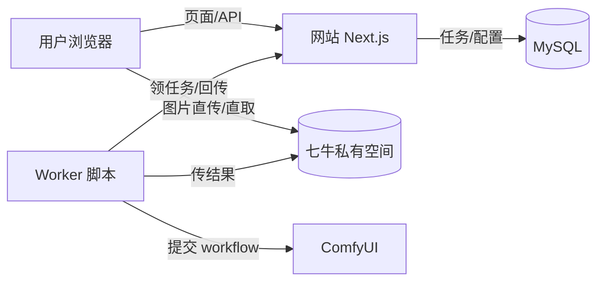

# 咔嚓造梦局

移动端优先的邀请制图像生成应用：用户上传照片、按分类选风格，ComfyUI 在后台生成趣味变体。匿名访客只能看演示；登录用户可创建真实任务。

> **第一次来？** 直接看 [QUICKSTART.md](QUICKSTART.md)，15 分钟跑通“传图 → 生成 → 看图”全流程。

## 系统速览



三句话：**网站不生成图片**（只管页面、登录、记账）；**图片都在七牛私有空间**（浏览器直连，网站只发限时链接）；**Worker 跑在 ComfyUI 那台机器上**干活。

原图不设前端大小限制；超过 200 万像素会在浏览器缩放并转 JPEG，最终不超过 20 MiB。

## 本地启动

```bash
npm install
cp .env.example .env.local   # 按 QUICKSTART 填好密钥
npm run db:migrate
npm run dev                  # http://localhost:3000
```

检查与常用命令：`npm run build`、`npm run lint`、`npm run typecheck`、`npm run start:worker`（启动 ComfyUI Worker）。

## 功能地图

| 能力 | 状态 | 去哪看 |
| --- | --- | --- |
| 邀请制登录（可重复登录、自动签发 API） | ✅ | [签发 runbook](docs/runbooks/issue-invitation-links.md) |
| 七牛直传、任务队列、结果查看 | ✅ | [七牛 runbook](docs/runbooks/qiniu-storage-and-jobs.md) |
| 后台：邀请码、用户、分类、预设、Workflow 配置 | ✅ | [后台 runbook](docs/runbooks/admin-console.md) |
| ComfyUI Worker：领任务、生成、回传 | ✅ | [Worker runbook](docs/runbooks/comfyui-worker.md) |
| 对象定期清理、Worker 在线状态展示 | ⬜ 待做 | 设计文档有约束说明 |

## 环境变量速查

`.env.example` 是唯一可信来源。核心就这几组：MySQL（`DATABASE_URL`）、后台（`ADMIN_API_TOKEN`）、Worker 对暗号（`WORKER_TOKEN`，网站和 Worker 填同一个）、七牛（`QINIU_*` 5 个，AK/SK 只放服务端）、邀请码（`INVITATION_ENCRYPTION_KEY`）。

## 文档入口

- 新手：[QUICKSTART.md](QUICKSTART.md)
- 运维：[docs/runbooks/](docs/runbooks/README.md)
- 架构与接口契约：[docs/design/](docs/design/README.md)

管理后台入口为 `/admin`（`ADMIN_API_TOKEN` 登录）。淘宝自动发货调 `POST /api/admin/invitations/issue`，用稳定 `orderRef` 保证重试不重发。
