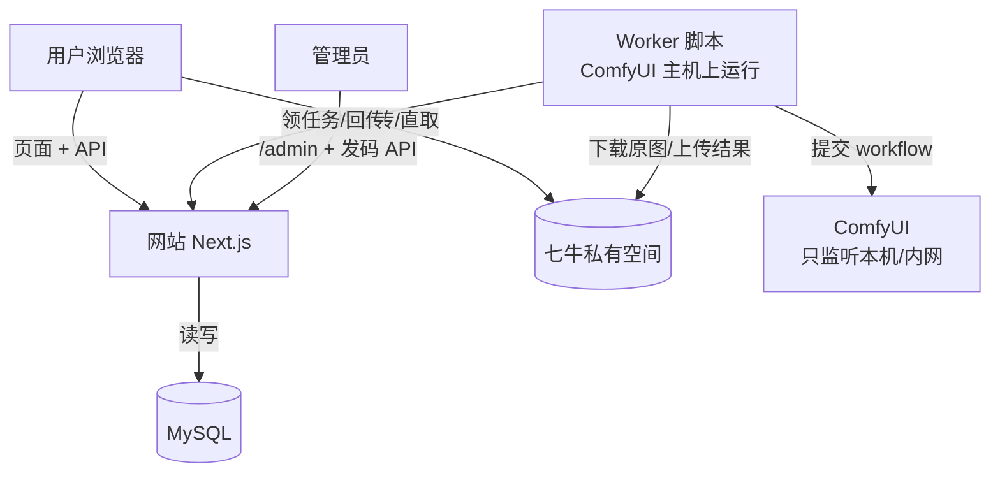
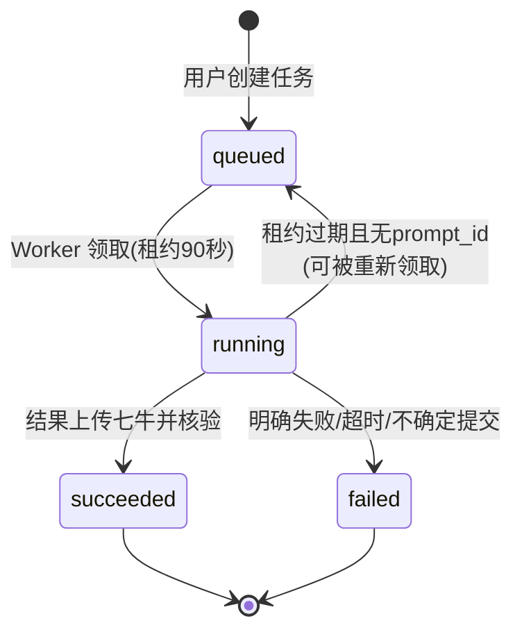

# 运维操作手册

> 给管理员和运维看的“动手手册”。第一次来？先走 [QUICKSTART](../../QUICKSTART.md)，15 分钟跑通全流程，再回来看细节。

## 系统长什么样（一图看懂）

记住三句话：**网站不管生成**（只管页面、登录、记账）；**图片都在七牛**（网站只发限时链接）；**Worker 在 ComfyUI 那台机器上干活**。

## 文档地图（按使用顺序读）

| 顺序 | Runbook | 一句话 | 什么时候看 |
| --- | --- | --- | --- |
| 0 | [QUICKSTART](../../QUICKSTART.md) | 15 分钟跑通 | 第一次搭建 |
| 1 | [本地 MySQL 与服务端配置](./local-mysql-and-auth.md) | 配库、配密钥、建表、验健康 | 搭环境、换环境 |
| 2 | [七牛直传与任务 API](./qiniu-storage-and-jobs.md) | 配存储、传图、建任务 | 图片传不上、任务建不了 |
| 3 | [后台管理控制台](./admin-console.md) | 邀请码、用户、分类、预设、Workflow 配置 | 日常运营、配新风格 |
| 4 | [签发登录链接](./issue-invitation-links.md) | 自动发货、批量发码、泄露应急 | 对接淘宝、码出问题 |
| 5 | [ComfyUI 本地 Worker](./comfyui-worker.md) | 配密钥、配 workflow、启动、排障 | 出不了图、任务失败 |

## 任务的一生（核心状态流转）

终态（`succeeded` / `failed`）不可再改。`execution_uncertain` 表示“可能已提交但没记下 ID”，必须人工核实，绝不自动重发——这是为了避免用户被重复扣费式生成。

## 架构与接口约定

详细的表结构、API 契约、租约语义见 [`../design/`](../design/README.md)。动手之前建议至少扫一眼总体设计。
