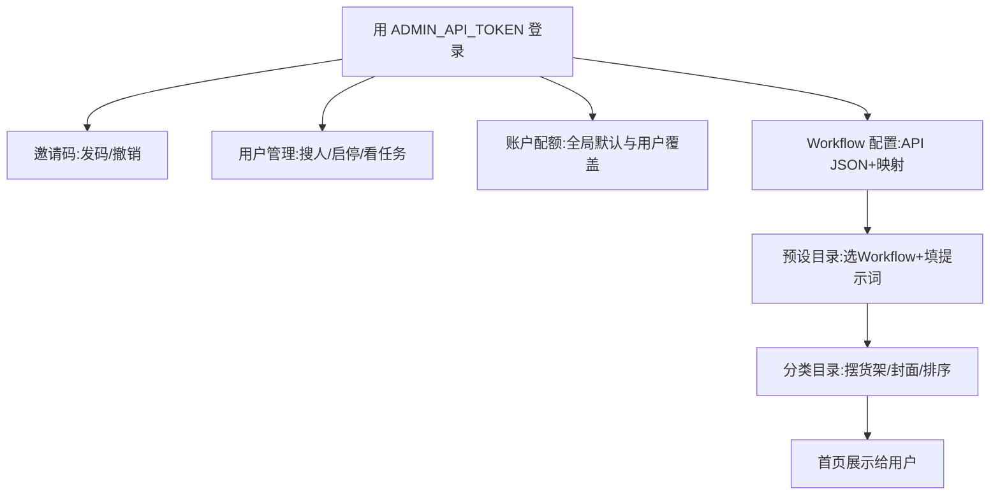
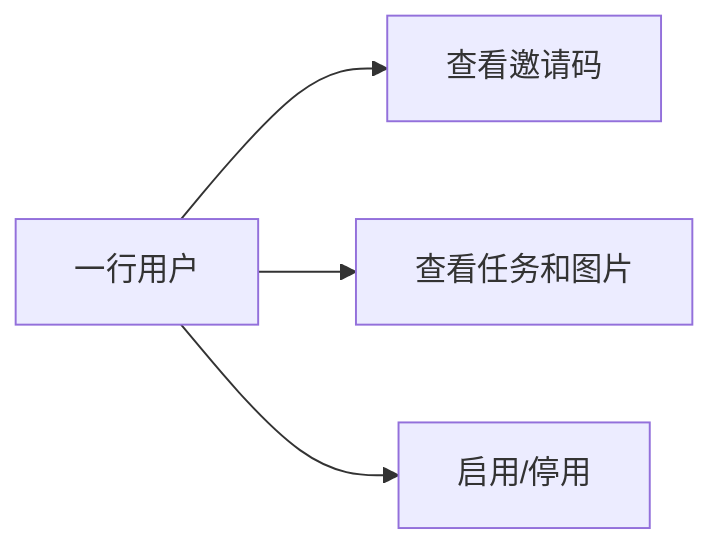
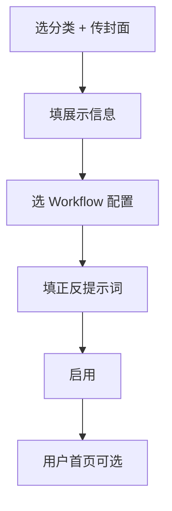

# Runbook：后台管理控制台

> `/admin` 是店主的柜台：发门票（邀请码）、看客人（用户）、摆货架（分类/预设/Workflow）。登录靠 `ADMIN_API_TOKEN`，进门后是 8 小时有效的管理员会话。



<sub>后台不是公开注册页：token 只给管理员，不进浏览器脚本、不发给买家。退出会撤销当前会话。</sub>

## 登录

1. 确认 `ADMIN_API_TOKEN`、数据库 migration、`GET /api/health` 都正常。
2. 打开 `http://localhost:3000/admin`（生产用正式域名），输入 token。
3. 过期就重登；右上角“退出”结束会话。

## 邀请码：发门票

- 手工签发：订单引用可空（会自动生成）；淘宝自动发货**必须**调 API 并给每份交付唯一稳定的 `orderRef`。
- 签发时可选账户有效期：1 小时、4 小时、24 小时（默认）、72 小时、1 周、30 天、365 天或无限期。时长从首次兑换邀请码时开始计算。首次兑换前，邀请码仍按自身兑换截止时间有效；首次兑换后，邀请码有效期延长至账户失效时间，以便账户期间续登（无限期账户的邀请码也不限期）。
- 用户账户失效后，现有会话立即失效；管理员可以在“账户配额”编辑/清除用户账户失效时间。恢复已过期账户前，需先延长/清除失效时间，再签发新邀请码。
- 响应丢了就用同一个 `orderRef` 重试，会返回同一条链接。
- “重新签发”是给同一用户开一条**新**链接，老链接还有效，要停用就单独撤销。
- 撤销只拦未来的登录，不踢掉已登录的会话；踢人要用用户管理的“停用”。

API 细节和泄露应急见 [签发 runbook](./issue-invitation-links.md)。

## 用户管理：看客人

按 user ID 搜索，看创建时间、邀请码数、任务数，启停用户。配额与账户有效期另在“账户配额”页管理。

- 停用＝立刻撤销他的登录会话；历史任务保留。启用后他要用新邀请码重登。
- 用户 ID 不能改名、不能删除。
- 「邀请码」旁的查看：弹窗看邀请记录、复制有效 code/链接（已撤销/过期不显示明文）。
- 「任务数」旁的查看：弹窗看任务状态、风格版本、心情备注、错误码，**原图和结果图都能直接看**（短时签名链接）。



## 账户配额：全局默认与用户覆盖

`/admin` →「账户配额」可以配置全局总任务上限（留空表示不限）和每日任务上限。全局值作为默认值；用户个人的总任务/每日任务覆盖值优先，留空则继承全局默认。限额 0 表示禁止新建任务；任务数统计所有已创建任务（包括失败任务），每日按 UTC 自然日统计。

“用户细分设置”可为单个用户单独设置两项限额及精确到分钟的账户失效时间；失效时间留空表示无限期。新邀请账户的有效期选项在邀请兑换时启动；migration `0009_user_limits_account_expiry.sql` 会将已有用户标记为不限期，不会因迁移突然过期。

## Workflow 配置：先备好“菜谱”

这是预设能出图的前提。点「Workflow 配置」→ 新建：

1. **配置 ID**：英文小写+连字符，如 `qwen-image-2-1-scream-edit`，建好不能改。
2. **API Workflow JSON**：从 ComfyUI 导出的 API 格式（节点 ID → `{class_type, inputs}`），**不是**带坐标的界面导出。
3. **节点映射 JSON**：告诉 Worker 图往哪送、字往哪填、结果去哪拿：

```json
{
  "inputImage": { "nodeId": "470", "inputName": "image" },
  "prompt": { "nodeId": "459:474", "inputName": "prompt" },
  "negativePrompt": { "nodeId": "459:474", "inputName": "negative_prompt" },
  "outputNodeIds": ["461"]
}
```

`inputImage` 和 `outputNodeIds` 必填；预览节点（如 PreviewImage）不是最终结果。改 JSON 或映射会自动涨版本号（V1→V2…）。

<sub>校验只查“节点和输入名存在”，不查模型装没装——模型/插件问题要到 ComfyUI 那台机器上验，见 [Worker runbook](./comfyui-worker.md)。</sub>

## 预设目录：把菜谱变成“套餐”

点「预设目录」→ 新建/编辑：

1. **所属分类**必选，**主展示图**必传（JPEG/PNG/WebP，≤5MB，直传七牛，库里只存引用）。
2. 填展示信息：名称、副标题、介绍、心情选项（JSON 数组）、提示文案、颜色、标签。
3. **Workflow 配置**下拉选一个：启用预设必须选**已启用**的 Workflow；停用草稿可以不选。
4. 填**正向提示词**（启用必填，可用 `{{mood}}` / `{{note}}` 占位）、负向提示词（可空）、固定附加参数（JSON，如 `{"steps": 8}`）。
5. 保存即产生预设新版本，并**锁定当时 Workflow 的版本**；以后改 Workflow 不影响已排队任务。



<sub>旧 `/art/*.svg` 封面只是迁移回退，新建必须上传。公开接口永远不下发 workflow 和密钥。</sub>

## 分类目录：摆货架

新建分类：ID（英文小写）、名称、排序数字、主展示图、启停。首页按排序展示分类封面，点分类只看它下面的风格。分类停用＝整架下架，但历史任务照常可查。删除分类需要确认；删除后其下的预设保留并改为“未分类”，封面资产不会自动删除。系统默认分类 `general` 不能删除。预设目录也有删除按钮，需确认；如果该预设仍有排队/运行任务，服务端会拒绝删除。删除预设不会删除已有任务或不可变版本快照；重新创建同 ID 的预设会沿用更高的版本号。

## ComfyUI 页

这里只是 Worker 的配置说明卡，不探测也不控制 ComfyUI。真要出图按 [Worker runbook](./comfyui-worker.md) 在 ComfyUI 那台机器上跑 Worker。
