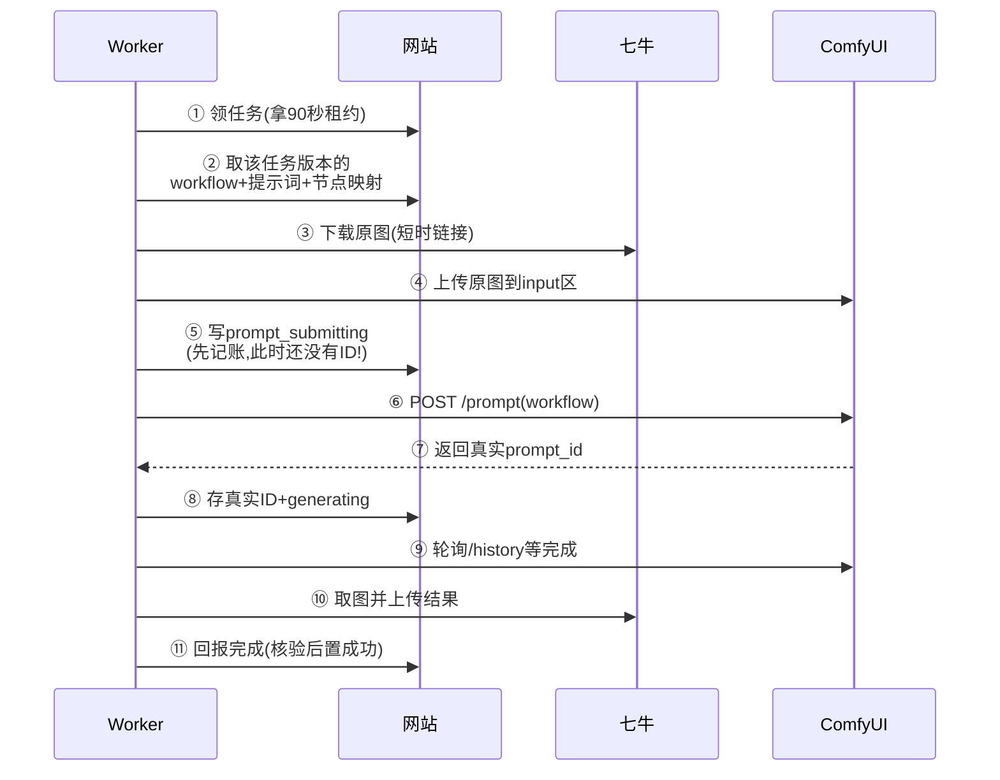

# Runbook：ComfyUI 本地 Worker

> 目标：让排队的任务真正出图。Worker 是个独立小脚本（`npm run start:worker`），跑在 **ComfyUI 那台机器**上：它去网站领任务、喂给 ComfyUI、把结果传回七牛。

## 流程总览（先看这张图）



**最关键的一行**：ComfyUI 的 `prompt_id` 是它生成的，不是我们指定的。所以顺序必须是“**先记账（⑤）→ 再提交（⑥）→ 拿到 ID 马上存（⑧）**”。如果 ⑥ 和 ⑧ 之间断了，任务会标 `execution_uncertain`，**绝不自动重发**（重发可能让用户花双倍时间/排两次队）。

## 1. 前置条件

- 网站已部署（含 `/api/worker/*`），`GET /api/health` 正常，migration 最新。
- 七牛配好（Worker 不需要 AK/SK，它只用网站发的短时链接）。
- ComfyUI 在跑，比如本机 `http://127.0.0.1:8188`，或 Tailscale 地址。
- 后台里要跑的风格已经配好 **API 格式** workflow 并启用（下一节）。

## 2. 配密钥（网站和 Worker 对暗号）

```bash
openssl rand -hex 32
```

把同一个值放到两处：网站服务端 `WORKER_TOKEN`，Worker 进程 `WORKER_TOKEN`。对不上会 401，Worker 直接退出。

| 变量 | 必需 | 说明 |
| --- | --- | --- |
| `WEB_API_BASE_URL` | 是 | 网站根地址，不带 `/api`。本地就是 `http://127.0.0.1:3000` |
| `WORKER_TOKEN` | 是 | 和网站完全相同的密钥 |
| `COMFY_BASE_URL` | 否 | 默认 `http://127.0.0.1:8188`；远端就填内网/Tailscale 地址，**不要填公网** |
| `WORKER_POLL_INTERVAL_MS` | 否 | 空队列轮询间隔，默认 4000ms |

<sub>用 systemd、容器 secret 或权限 600 的环境文件提供这些值；换密钥后两边一起换并重启 Worker。日志里只会有 job_id 和阶段，看不到密钥和图片，这是设计。</sub>

## 3. 配 Workflow（后台点点就行）

1. 在 ComfyUI 里导出 **API 格式** JSON（节点 ID → `{class_type, inputs}` 的那种，不是带坐标的界面导出）。
2. 后台「Workflow 配置」→ 新建：粘贴 JSON，再填节点映射。以 Qwen 图像编辑为例：

```json
{
  "inputImage": { "nodeId": "470", "inputName": "image" },
  "prompt": { "nodeId": "459:474", "inputName": "prompt" },
  "negativePrompt": { "nodeId": "459:474", "inputName": "negative_prompt" },
  "additional": {
    "steps": { "nodeId": "459:458", "inputName": "steps" }
  },
  "outputNodeIds": ["461"]
}
```

3. 后台「预设目录」→ 编辑预设：下拉选这个 Workflow，填正向/负向提示词，启用。

记住三条铁律：

- `inputImage` 和 `outputNodeIds` 必填；`PreviewImage` 之类的预览节点**不是**最终结果，别选它。
- Workflow 里的正反提示词可以留空，留空就由预设提供；预设启用时正向提示词必填。
- 保存预设会**锁定 Workflow 当前版本**；以后改 Workflow 会涨版本号，老任务不受影响。

<details>
<summary>节点 ID 变了怎么办（点开）</summary>

重新导出后 ID 可能变化（如 `459:474` 变成别的）。这时去改 Workflow 配置（版本会自动 +1），再到预设里重新选一次、保存，产生预设新版本。正在排队的老任务继续用老版本跑，不受影响。

</details>

## 4. 启动与验证

```bash
npm run start:worker
```

验证清单：

1. `curl --fail http://127.0.0.1:8188/system_stats`（或你的远端地址）在 ComfyUI 那台机器上正常；**从公网打不开 ComfyUI 端口**才对。
2. 没任务时 Worker 安静轮询；来任务后日志出现 `claimed → complete`。
3. 用户页任务 `queued → running → succeeded`，“我的作品”出现结果图。
4. 后台用户管理的任务详情里能看到原图和结果图。

## 5. 故障速查

| 现象/错误码 | 含义和做法 |
| --- | --- |
| 任务一直 `queued` | Worker 没跑 / token 两边不一致 / 预设没绑启用的 Workflow |
| `preset_not_found_or_unavailable` | 预设版本没有 workflow（演示风格），换绑好的预设 |
| `comfy_http_4xx/5xx`、`generation_failed` | ComfyUI 拒了：查节点映射、模型/插件装没装、显存够不够 |
| `generation_timeout` | 20 分钟没出图：ComfyUI 卡住或队列太长，去 ComfyUI 那边看 |
| `execution_uncertain` | **可能已提交但 ID 没记下**：先查 ComfyUI `/queue` 和 `/history/{id}` 核实，确认没跑再让用户新建任务；**不要直接重试** |
| `attempt_timeout` / `worker_attempt_limit` | 任务超时或重试超 3 次：看 Worker 日志定位哪一步慢 |
| `lease_invalid` | 租约丢了（别人接手了）：当前 Worker 会停手，这是保护机制 |

<details>
<summary>重启恢复是怎么保证不重复提交的（点开）</summary>

- 提交前崩溃（还没真实 ID）：过期租约可被重新领取，从下载原图开始。
- 已有真实 ID：新 Worker 先查 `/history/{id}`，没有再查 `/queue`，有就继续等结果；两边都没有才标 `execution_uncertain`。
- 输出已传但完成上报丢了：输出 key 是 `outputs/{jobId}/{index}` 固定的，重传会覆盖同一个对象，完成接口幂等。

</details>

## 6. 本地联调备忘（Tailscale 远端 ComfyUI）

- `COMFY_BASE_URL=http://100.78.52.73:8188` 这类内网地址直接配就行，Worker 不关心是本机还是远端。
- 先 `curl` 一下远端的 `/system_stats` 和 `/queue` 确认通，再启动 Worker。
- 本地网站用 `http://127.0.0.1:3000`，Worker 配 `WEB_API_BASE_URL` 指向它。
