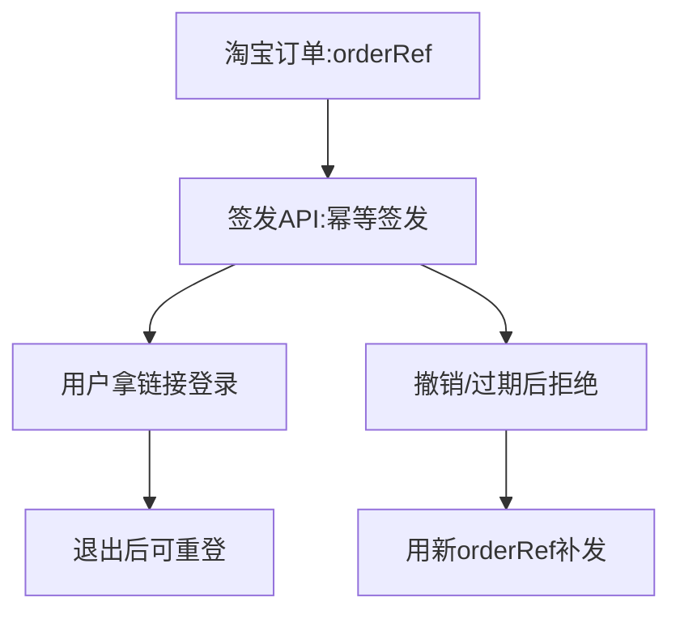

# Runbook：签发可重复登录的邀请码链接

淘宝自动发货优先直接调用 `POST /api/admin/invitations/issue`。管理员人工签发可使用 `/admin` 控制台，批量补发可使用 `scripts/create-invitations.mjs`。邀请链接可重复用于登录，直到过期或管理员撤销；用户退出只撤销当前会话，不会使原链接失效。API 将码以加密密文保存以支持订单重试；新版 CLI 导入会把码加密存储，后台可查看/复制。



## 前置条件

1. 按 [本地 MySQL 与服务端配置](./local-mysql-and-auth.md) 应用 migrations。
2. 目标应用已设置与 CLI 相同的 `ADMIN_API_TOKEN`；本地发码时，应用正在 `http://localhost:3000` 运行。生产发码时使用正式 HTTPS 域名。
3. 如需固定用户标识，发货端提供 `userId`（3–64 个英文字母、数字、下划线或连字符）；否则提供稳定的 `customerRef`，服务端会派生用户标识。用户不能自行指定/更改标识。
4. 在可信管理员设备上安全保管 CLI 补发使用的 `INVITE_SEED`。首次签发时用加密密码管理器/企业密钥库保存至少 32 随机字节的 seed；同一环境后续必须继续使用**同一个 seed**。seed 不放入应用 `.env.local`、Vercel、Git 或聊天记录。
5. 在服务端配置 `APP_BASE_URL` 和 `INVITATION_ENCRYPTION_KEY`。`INVITATION_TTL_DAYS` 可选，默认为 30 天。加密密钥使用 `openssl rand -base64 32` 生成，放入 `.env.local`/生产密钥库；它与 CLI 的 `INVITE_SEED` 是不同秘密。

生成一个新 seed（只在首次建立发码密钥时做一次，生成后保存到受控密钥库）：

```bash
openssl rand -base64 32
```

生成管理员 API token（必须与目标应用环境中的 `ADMIN_API_TOKEN` 完全一致）：

```bash
openssl rand -base64 48
```

不要为每次签发都生成新 seed。邀请码由 `seed + batch-id + ordinal` 决定；更换 seed 后重用原批次/序号会与已导入记录冲突。

## 签发并导入

### 淘宝自动发货：调用管理员签发 API（推荐）

将发货端配置为对正式站点发送 HTTPS `POST /api/admin/invitations/issue`，请求头带服务端 `Authorization: Bearer <ADMIN_API_TOKEN>`，请求体示例：

```json
{
  "orderRef": "taobao-order-id:item-id:fulfillment-sequence",
  "customerRef": "stable-customer-reference"
}
```

`orderRef` 必填：它必须是**一次交付唯一且重试稳定**的引用；同一订单有多件商品/多份交付时，为每份生成不同的稳定 orderRef。原始订单引用只用于服务端计算 SHA-256 幂等键，不写入数据库。`customerRef` 可选；不传 `userId` 时服务端根据 customerRef（若未提供则根据 orderRef）生成不含原始客户信息的稳定用户标识。也可由发货端直接传入预先约定的 `userId`：

```json
{
  "orderRef": "taobao-order-id:item-id:fulfillment-sequence",
  "userId": "buyer_8f42d1"
}
```

新签发返回 `201`，同一个 orderRef/userId 重试返回 `200` 和相同链接；同一个 orderRef 改用另一个 userId 返回 `409 order_conflict`。返回示例：

```json
{
  "userId": "taobao_0123456789abcdef01234567",
  "invitationId": "...",
  "inviteUrl": "https://your-domain.example/#invite=XXXXX-XXXXX-XXXXX-...",
  "expiresAt": "...",
  "idempotent": false
}
```

自动发货端只需把 `inviteUrl` 发送给买家，不要把管理员 token 放进浏览器代码或发给买家。淘宝回调如由不可信互联网直接触发，应先在发货服务校验淘宝签名，再由可信服务端调用此 API。成功响应中的邀请链接属于 bearer 秘密：勿记录完整响应体到公开日志或工单。

API 状态码：新建 `201`、同单幂等重试 `200`、同一 `orderRef` 绑定用户冲突 `409 order_conflict`、输入不合法 `400`、管理员认证失败 `401`、RDS/密钥/服务配置异常 `503 service_unavailable`。相同请求重试会返回相同 URL，即使第一份响应已经发给用户；服务端使用 `INVITATION_ENCRYPTION_KEY` 加密存储链接中的码。必须备份并保持该密钥稳定；丢失密钥不影响已发出的链接兑换（数据库仍有摘要），但会使重试无法重新取回原邀请链接。

### 管理员 CLI：人工/批量导入

命令参数为：

```text
npm run invitations:create -- <batch-id> <user-id> [count] [ordinal-start]
```

- `batch-id`：每批唯一、仅用字母数字/`_`/`-`，例如 `pilot-2026-09`。
- `user-id`：管理员预先指定的唯一用户标识。
- `count`：签发数量，默认 1，最多 100；同一条命令签出的码都绑定到同一个 user-id。
- `ordinal-start`：批次内起始序号，默认 1。不同用户分开发码时，为每个用户分配不重叠的序号，例如 `1`、`2`、`3`。

在本地开发环境签发示例：

```bash
read -r -s -p "Invite seed: " INVITE_SEED; printf '\n'
read -r -s -p "Admin API token: " ADMIN_API_TOKEN; printf '\n'
export INVITE_SEED ADMIN_API_TOKEN
export APP_BASE_URL="http://localhost:3000"
npm run invitations:create -- pilot-2026-09 user_001 1 1
unset INVITE_SEED ADMIN_API_TOKEN APP_BASE_URL
```

生产发码时将 `APP_BASE_URL` 改为正式 HTTPS origin。避免把 seed/token 直接写进命令参数、shell 脚本、终端录屏或 CI 日志。工具导入成功后输出格式如下：

```text
user_001  1  https://your-domain.example/#invite=XXXXX-XXXXX-XXXXX-...
```

链接将邀请码放在 `#invite=...` URL fragment 中：fragment 不会随初始 HTTP 请求发给服务器。应用打开页面后会预填邀请码并打开登录框、立刻从地址栏移除邀请码，但**不会自动登录**，用户需主动确认。重复打开最初收到的链接即可再次登录；聊天/淘宝订单中的原始邀请链接不会因为登录或退出而失效。应用也兼容 `?invite=...`，但管理发码应优先使用工具生成的 fragment 链接。

## 交付与核验

1. 通过私密渠道将链接交给与该 user-id 对应的用户，不要发到公开群、公开 issue 或带公开访问权限的文档。
2. 告知用户打开链接后确认登录；成功后页面显示其用户标识。同一个邀请链接可重复登录，单次用户会话默认最长 30 天。
3. 同一批次/序号/seed 重跑命令会生成相同邀请码；若记录绑定信息一致，导入是幂等的并会再次输出相同链接。保留 seed 和批次登记记录，避免丢失后无法重建尚未交付的链接。
4. 用户退出后只需重新打开原邀请链接，无须重新签发。管理员可在 `/admin` → 用户管理 → 查看邀请码中查看/复制有效链接。API 签发的邀请可使用原 `orderRef` 幂等重取；新版 CLI 邀请已加密存储 code，旧版仅存 hash 的记录无法恢复明文，可用原 seed/batch/ordinal 重建链接。若已过期或被撤销，再为同一用户签发新链接。

## 紧急处理邀请码泄露

管理员后台可撤销未撤销的邀请链接，无论该链接是否已登录使用。若使用受控 SQL 紧急撤销，更新 `revoked_at`（不会伪装成首次登录）；只对确认泄露的单码执行，并核对 `ROW_COUNT()` 为 1。后台撤销会写入审计事件，直接 SQL 操作需在组织自己的变更记录中登记：

```sql
START TRANSACTION;
SET @invite_code = UPPER(REPLACE(REPLACE('XXXXX-XXXXX-XXXXX-...', '-', ''), ' ', ''));
UPDATE invitations
SET revoked_at = UTC_TIMESTAMP(3)
WHERE code_hash = SHA2(@invite_code, 256)
  AND revoked_at IS NULL;
SELECT ROW_COUNT() AS invalidated_count;
COMMIT;
```

若 `invalidated_count` 为 0，可能是码错误、已撤销或不存在；不要扩大 UPDATE 条件。邀请码撤销不等于撤销用户已有会话；停用用户会撤销其会话。

API 签发的码密文存储于 `invitations.code_ciphertext`，不能通过仅有 `code_hash` 的 CLI 导入路径重建链接。若 API 签发链接泄露，优先在 `/admin` 邀请码表撤销。紧急时可使用受控 SQL 将**指定 `invitationId`** 标记为已撤销，并核对目标订单引用摘要/用户标识；不要导出密文或直接修改其他订单记录：

```sql
START TRANSACTION;
UPDATE invitations
SET revoked_at = UTC_TIMESTAMP(3)
WHERE id = '<确认过的 invitationId>'
  AND issue_source = 'taobao'
  AND revoked_at IS NULL;
SELECT ROW_COUNT() AS invalidated_count;
COMMIT;
```

## 常见错误

| 结果 | 含义与处理 |
| --- | --- |
| `401 unauthorized` | `ADMIN_API_TOKEN` 与应用环境不一致，或 API 未配置该 token；不要把 token 发给用户 |
| `409 order_conflict` | 同一个 `orderRef` 已绑定其他用户；检查淘宝重试是否传入一致的用户标识。不可为同一个交付引用改绑用户 |
| `409 invitation_revoked` | 此订单引用对应的邀请码已撤销；签发补发码时使用新的订单引用 |
| `409 invitation_conflict` | CLI 的相同 batch-id/ordinal 已绑定了不同用户、摘要或有效期；不要覆盖。改用新批次/序号，先检查 seed 和发码记录 |
| `429 rate_limited` | IP 超过兑换尝试限额（每 15 分钟最多 10 次）；等待限流窗口结束，勿反复重试 |
| `503 service_unavailable` | API/RDS 暂不可用；先检查 `/api/health` 和服务日志，确认后再重跑相同签发命令 |
| CLI 显示导入失败且不输出链接 | 不要手工编造或发送未确认导入的链接；排除错误后用相同 seed、batch-id 和 ordinal 重试 |
