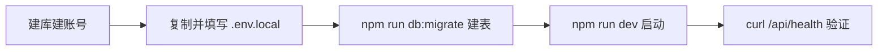

# Runbook：本地 MySQL 与服务端配置

> 目标：让网站连上数据库、配好密钥，能登录后台。做完这一步，`GET /api/health` 应该返回 `{"status":"ok","database":"ok"}`。

## 流程总览



生产环境还要加 TLS 和独立账号（见下文折叠细节）；本地开发先跑通即可。

## 1. 准备数据库

建一个应用专用数据库和账号，只给它这个库的建表、索引和读写权限。

- RDS：把开发机（或 Vercel 出口）加入访问白名单，**不要对全网开放**。
- 连接串格式：`mysql://<用户>:<密码>@<主机>:3306/<库名>`，特殊字符要 URL 编码。

<details>
<summary>生产 TLS 与账号细节（点开）</summary>

- 生产 `NODE_ENV=production` 会强制校验服务端证书；若 RDS 的 CA 不在系统信任链，把 CA PEM 转 base64 放 `MYSQL_SSL_CA_BASE64`。
- 预览环境和生产环境用**不同的库和不同的管理员 token**，避免测试邀请码混入生产。
- 迁移命令不会自动建库，库和账号要在控制台先建好。

</details>

## 2. 配置应用

```bash
cp .env.example .env.local
```

填下面这张表（“怎么生成”列可直接复制执行）：

| 变量 | 用途（一句话） | 怎么生成/填 |
| --- | --- | --- |
| `DATABASE_URL` | 连哪个库 | 按第 1 节的格式拼 |
| `ADMIN_API_TOKEN` | 后台登录密码 | `openssl rand -base64 48` |
| `WORKER_TOKEN` | Worker 和网站对暗号的密钥，两边必须相同 | `openssl rand -hex 32` |
| `APP_BASE_URL` | 本机填 `http://localhost:3000`；生产填最终 HTTPS 域名 | 手填 |
| `INVITATION_ENCRYPTION_KEY` | 邀请码加密密钥，丢了就找不回已发链接 | `openssl rand -base64 32`，备份好 |
| `QINIU_*`（5 个） | 七牛存储配置 | 见 [七牛 runbook](./qiniu-storage-and-jobs.md) |
| `INVITATION_TTL_DAYS` | 邀请链接有效期，可选，默认 30 天 | `1–365` |

<sub>`INVITATION_ENCRYPTION_KEY` 同一环境不要换，换了自动发货重试就还原不出原来的链接。`.env.local` 绝不进 Git，也不要贴到聊天/工单里。</sub>

## 3. 建表

```bash
npm run db:migrate
```

成功后会有用户、邀请码、会话、分类、预设、上传占位、任务、输出、审计等表。重复跑是安全的；有新 migration 先看一眼 SQL 再跑。

## 4. 启动并验证

```bash
npm run dev
```

另开终端：

```bash
curl --fail --silent --show-error http://localhost:3000/api/health
# 期望 {"status":"ok","database":"ok"}
```

| 返回 | 含义 |
| --- | --- |
| `ok / ok` | 全部正常，继续 |
| `database: unavailable`（503） | 连不上库：按顺序查 URL/密码 → 库名 → 账号授权 → 白名单 → TLS |

## 5. 接下来

- 配七牛并传第一张图 → [七牛 runbook](./qiniu-storage-and-jobs.md)
- 进后台发邀请码、管理风格 → [后台 runbook](./admin-console.md)
- 让任务真出图 → [Worker runbook](./comfyui-worker.md)

<sub>当前能力：邀请码导入/兑换/退出、自动签发 API、七牛直传、任务队列、Worker 程序都已实现。没有数据库时页面只能看演示，接口会返回不可用。</sub>
