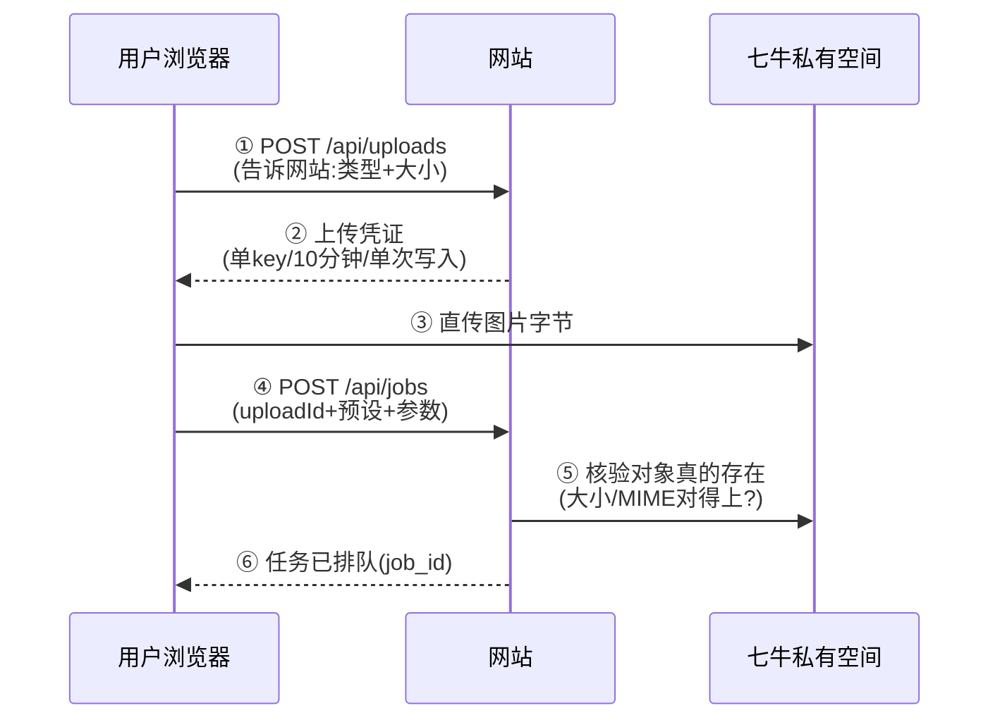

# Runbook：七牛直传与任务 API

> 目标：图片存到七牛私有空间，用户能上传照片并创建任务。记住关键设计：**图片字节永远不经过网站服务器**——浏览器和七牛直连，网站只发“限时通行证”。

## 流程总览



第 ⑥ 步只表示“图已存好、任务已记账”，**不代表已生成**。Worker 在线且预设配好 workflow 后才会开始画图（见 [Worker runbook](./comfyui-worker.md)）。

## 1. 配置七牛服务端变量

在 `.env.local` 或部署环境变量设置：

| 变量 | 说明 |
| --- | --- |
| `QINIU_ACCESS_KEY` / `QINIU_SECRET_KEY` | 服务端专用，严格保密 |
| `QINIU_BUCKET` | **私有空间**名 |
| `QINIU_UPLOAD_URL` | 按 bucket 所在区域选（下表），不要猜 |
| `QINIU_PRIVATE_DOMAIN` | 绑到该空间的 HTTPS 下载域名，如 `https://images.example.com` |

| 区域 | `QINIU_UPLOAD_URL` |
| --- | --- |
| 华东 z0 | `https://up.qiniup.com` |
| 华北 z1 | `https://up-z1.qiniup.com` |
| 华南 z2 | `https://up-z2.qiniup.com` |
| 北美 na0 | `https://up-na0.qiniup.com` |
| 新加坡 as0 | `https://up-as0.qiniup.com` |

改完重启 Next.js。

## 2. 配置七牛 CORS（否则浏览器传不上去）

在 bucket 的 CORS 规则里放行你的网站 origin：

- Origins：本地 `http://localhost:3000`，生产填正式域名；**不要写 `*`**。
- Methods：`POST`、`OPTIONS`。
- Allowed headers：至少 `Content-Type`（控制台要求的话再加 `Origin`）。

<sub>CORS 只是“允许浏览器敲门”，真正的权限在上传 token 里：限定单个随机 key、单次写入、指定 MIME、最多 20 MiB、10 分钟过期。AK/SK 永远不发给浏览器。</sub>

## 3. 检查配置与登录

```bash
curl --fail --silent --show-error http://localhost:3000/api/health
```

确认用户已用邀请码登录（`GET /api/auth/me` 能返回用户标识）。没登录时上传和任务接口返回 `401`。

## 4. 传一张图、建一个任务（页面点点就行）

1. 打开创作页，选 JPEG/PNG/WebP。
2. 页面会自动预处理：超过 200 万像素就等比缩小并转 JPEG；太大就压质量，保证最终不超过 20 MiB。
3. 选风格（心情必选，补充文字最多 120 字），点“上传并创建任务”。

<details>
<summary>给想调接口的人：请求形状（点开）</summary>

```http
POST /api/uploads
Content-Type: application/json
Cookie: <user-session-cookie>

{"contentType":"image/jpeg","size":123456}
```

```json
{
  "uploadId": "<上一步返回的 ID>",
  "presetId": "masterpiece-scream",
  "parameters": { "mood": "惊讶", "note": "咖啡洒了" },
  "idempotencyKey": "<本次点击生成的 UUID>"
}
```

规则：`idempotencyKey` 是“这次点击”的身份证——重试用同一个值会返回原任务；新一轮生成用新值。每人同时只能有 1 个未完成任务，每天最多 10 次。一个上传只能用一次。

</details>

## 5. 查自己的任务和结果

- `GET /api/jobs`：只列自己的任务，没有别人的，也没有对象 key。
- `GET /api/jobs/{id}`：看状态（`queued → running → succeeded / failed`）。
- `GET /api/jobs/{id}/result`：成功且是本人的任务，返回**约 5 分钟有效**的私有下载链接数组。

<sub>链接过期就刷新页面重取，不要把链接存下来当永久地址。</sub>

## 常见问题

| 现象 | 先查什么 |
| --- | --- |
| `/api/uploads` 报 `503 storage_unavailable` | 七牛 5 个变量配齐了吗？看服务端日志（别打印密钥） |
| 浏览器上传 CORS / Network Error | bucket CORS 的 origin、POST/OPTIONS、区域 endpoint 对上了吗 |
| `/api/jobs` 报 `422 upload_not_found_in_storage` | 浏览器那次直传到底成功了吗？key/token 是不是被覆盖了 |
| `/api/jobs` 报 `422 upload_object_mismatch` | 声明大小和七牛实际大小/MIME 对不上，换张正常图片重试 |
| `429 active_job_limit` | 这个人已有未完成任务；看看 Worker 是不是在线 |
| `409 preset_not_ready` | 这个预设还没配 workflow（演示风格），换个已启用的风格 |
| 任务一直 `queued` | Worker 没跑 / `WORKER_TOKEN` 两边不一致 / 预设 workflow 没配好 |

## 还没做的事

对象生命周期与孤儿文件定期清理、后台 Worker 在线状态展示还没实现。测试时别传隐私或超大文件；正式开放前要定好输入/输出图的保留期限并在 UI 告诉用户。
